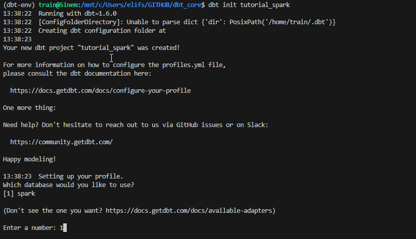
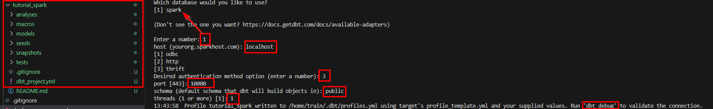
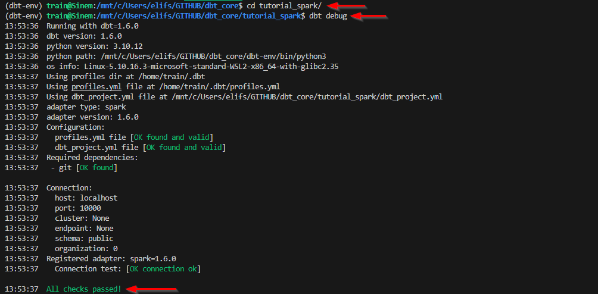

# dbt Core

dbt Core is a popular open-source command-line tool that's used for orchestrating and managing the transformation and modeling of data in your data warehouse. It's particularly well-suited for data analytics teams that work with SQL-based transformations in data warehousing environments. Here are some reasons why you might consider using DBT in your data workflows:

- Modularity and Reusability
- Version Control
- Code Reviws and Collaboration
- Data Testing
- Incremental Processing
- Easy Deployment
- Documentation
- Data Lineage
- Elastic Compute Scaling
- Community and Ecosystem

In this repo we will discover dbt Core with Apache Spark 

## Prerequisites
- Python 3.10 (Version 3.8 or higher is suitable) 
- Spark (Version 3.1.1) Trift Server
- Linux OS (to directly use the commands in)

## Steps

- Create Spark Trift Server using Docker
- Copy csv files to docker container
- Connect Spark container bash
<!-- - Create venv
- Install dbt -->
- Connect using beeline to set up tables for Spark-SQL
- Create tables using csv files


## Run Spark Thrift Server

[This docker-compose](https://github.com/ElifSinemAktas/dbt_core/blob/main/docker-compose.yaml) starts a Spark Thrift server and a Postgres database as a Hive Metastore backend.

```shell
docker-compose up -d
```
```shell
docker ps
```
```shell
CONTAINER ID   IMAGE                      COMMAND                  CREATED       STATUS       PORTS                                              NAMES
0594d2d79ef6   godatadriven/spark:3.1.1   "/scripts/entrypoint…"   3 weeks ago   Up 3 hours   0.0.0.0:4040->4040/tcp, 0.0.0.0:10000->10000/tcp   dbt_core-dbt-spark3-thrift-1
ef7fb9edd3aa   postgres:9.6.17-alpine     "docker-entrypoint.s…"   3 weeks ago   Up 3 hours   0.0.0.0:5433->5432/tcp                             dbt_core-dbt-hive-metastore-1
```

## Copy csv files to docker container

Change "your_path" and "container_id" as your info.

```shell
cd /*your_path*/dbt_core/seeds
```
```shell
docker cp raw_customers.csv *container_id*:/opt
```
```shell
docker cp raw_orders.csv *container_id*:/opt
```
```shell
docker cp raw_payments.csv *container_id*:/opt
```

### Connect Spark Container
```shell
docker-exec -it <container_id> bash
```

### Run Beeline and Connect Hive
```shell
/usr/spark/bin/beeline
```

```shell
!connect jdbc:hive2://localhost:10000
```

Example Output:
```commandline
root@0594d2d79ef6:/# /usr/spark/bin/beeline
log4j:WARN No appenders could be found for logger (org.apache.hadoop.util.Shell).
log4j:WARN Please initialize the log4j system properly.
log4j:WARN See http://logging.apache.org/log4j/1.2/faq.html#noconfig for more info.
Beeline version 2.3.7 by Apache Hive
beeline> !connect jdbc:hive2://localhost:10000
Connecting to jdbc:hive2://localhost:10000
Enter username for jdbc:hive2://localhost:10000: train
Enter password for jdbc:hive2://localhost:10000: ********
Connected to: Spark SQL (version 3.1.1)
Driver: Hive JDBC (version 2.3.7)
Transaction isolation: TRANSACTION_REPEATABLE_READ
0: jdbc:hive2://localhost:10000>
```

### 2.3.2 Create tables with data
```shell
CREATE TABLE default.raw_customers (
    id int,
    first_name string,
    last_name string
    ) USING CSV
OPTIONS (path "/opt/raw_customers.csv",
        delimiter ",",
        header "true");

CREATE TABLE default.raw_orders (id int,
user_id int,
order_date date,
status string
)
USING CSV
OPTIONS (path "/opt/raw_orders.csv",
        delimiter ",",
        header "true");

CREATE TABLE default.raw_payments (id int,
user_id int,
payment_method string,
amount bigint
)
USING CSV
OPTIONS (path "/opt/raw_payments.csv",
        delimiter ",",
        header "true");
```

## Create venv 

```shell
python3 -m venv dbt-env
```
```shell
source dbt-env/bin/activate
```

## Install DBT 
```shell
pip install "dbt-spark[PyHive]"
```

Note: sasl installation can be problem when installing the package.
If you are using linux you can follow the steps [here](https://stackoverflow.com/questions/70347149/installing-sasl-in-python).

## Initilize and configure dbt

```shell
dbt init tutorial_spark
```



After configuration, a folder system will be created.

## Check if configuration is okay
```shell
cd tutorial_spark
```
```shell
cd dbt debug
```



# Resources
- Docker Compose: https://github.com/dbt-labs/dbt-spark
- Understanding Spark-SQL: https://spark.apache.org/docs/3.1.1/sql-distributed-sql-engine.html
- Apache Spark Setup for dbt: https://docs.getdbt.com/docs/core/connect-data-platform/spark-setup
- Data Source: https://github.com/dbt-labs/jaffle_shop
- Solving csv header problem: https://kb.databricks.com/sql/query-not-skip-header-ext-table
